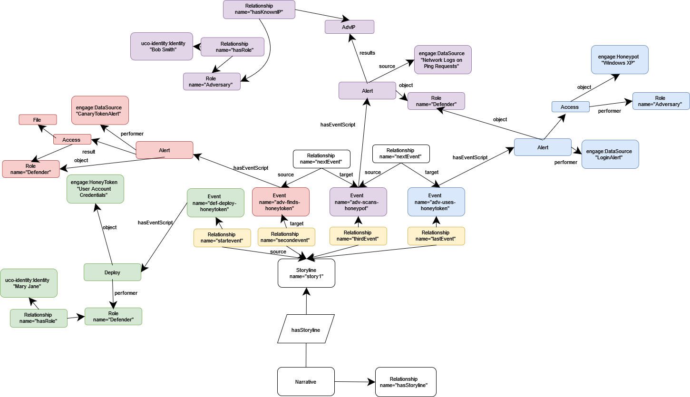

# Honeypot Narrative Example

The usage of this example is to demonstrate how to narrate a sequences of expected events which representations the desired process for a deception operation.

A few concepts to keep in mind:
- `Storyline` is used to describe a set of events which relate to each other for a single trajectory of a deception operation.
- `Narrative` or alternatively a deception campaign is the association to any and all sequences of events tied to a single identity campaign.
- `Relationship` comes from UCO and requires adoption
- All action classes e.g. `Access`, `Alert` rely UCO's action class and its current properties, please note the adoption.
- `Relationship` is used to describe ordinal relationships between Events instead of properties to allow for flexibility across multiple Storylines

### 1. Event 1 (highlighted in green)

The first expected event named "def-deploy-honeytoken" has an associated hasEventScript property, linking the Event object and the action associated with the event. Other objects and identities relating to this action are expressed through the UCO action properties e.g. `performer`,`object`.

The event describes that a role defender identity deployed honeytoken credentials.

### 2. Event 2 (highlighted in red)

The second expected event named "adv-finds-honeytoken" describe an event where some data source "CanaryTokenAlert" alerts a defender role that there has been access to a particular file which contains the honeytoken credentials.

### 3. Event 3 (highlighted in purple)

The third expected event named "adv-scans-honeypot" describe an event where some data source "NetworkLog" which alerts a defender role that a known adversary IP pinged the honeypot.

### 4. Event 4 (highlighted in blue)

The last expected event named "adv-uses-honeytoken" describe an event where some data source "LoginAlert" alerts a defender role that an adversary logged into the intended Windows XP Honeypot using the honeytoken credentials.
